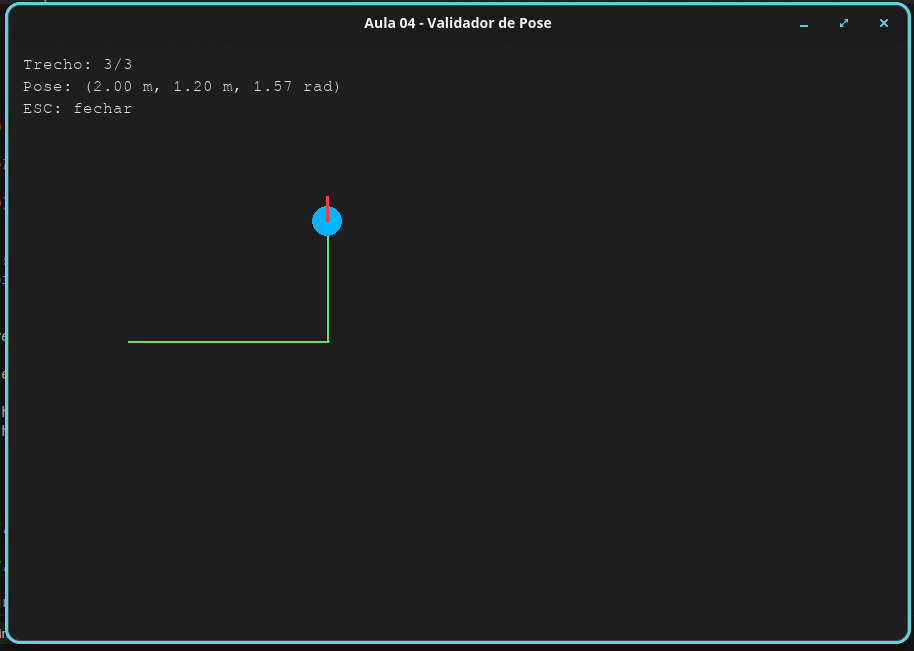
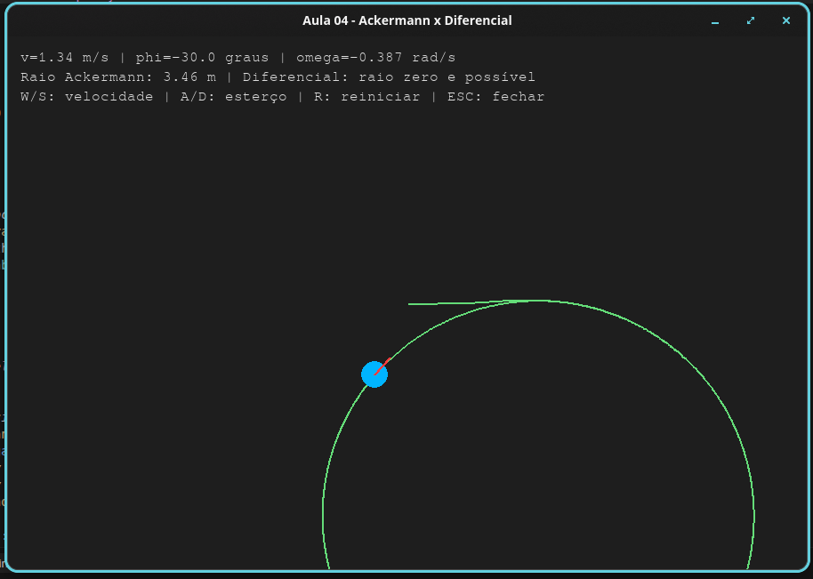
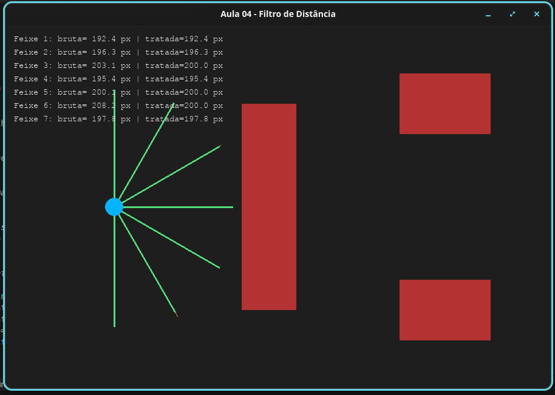
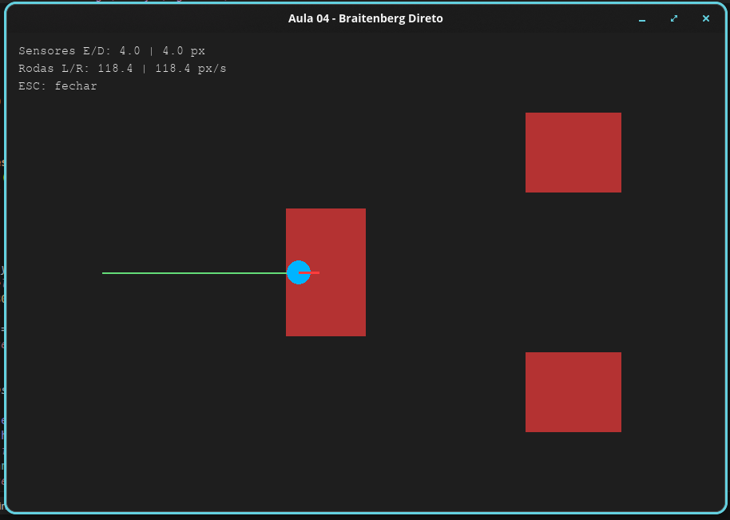
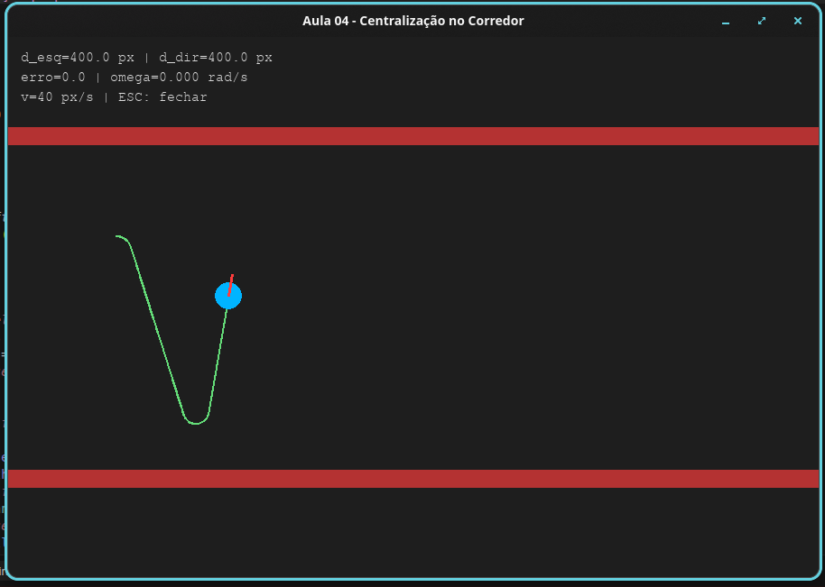

# Relatório Final — AULA 04: Cinemática Diferencial, Ackermann e Controle Proporcional

## 1. Resultados Encontrados nos Laboratórios

### Laboratório 1 — Validador de Pose em Malha Aberta

O robô parte de `(0, 0, 0)` e executa três trechos temporizados: avanço reto de 2,0 m (`v = 0,5 m/s` por 4 s), giro in-place de 90° (`ω = 0,7854 rad/s` por 2 s) e avanço de 1,2 m na nova orientação (`v = 0,4 m/s` por 3 s).

**Observação sobre o roteiro:** o texto do roteiro menciona giro de 45°, porém os parâmetros numéricos (`ω = π/4 rad/s` durante 2 s) produzem rotação de **90°** (`θ = 1,5708 rad`). Os cálculos e a simulação seguem os parâmetros informados.

A pose final teórica (integração analítica) e a pose simulada (Euler discreto a 60 FPS) coincidem:

```text
Pose final teórica: x=2.0000 m, y=1.2000 m, theta=1.5708 rad
Pose simulada:      x=2.0000 m, y=1.2000 m, theta=1.5708 rad
```

O erro de integração nesta sequência é desprezível porque os trechos de rotação e translação são ortogonais: o giro ocorre com `v = 0` e o deslocamento final ocorre com `θ` já estabilizado. A trajetória desenhada no Pygame confirma o padrão em "L": reta, curva e reta perpendicular.



---

### Laboratório 2 — Ackermann x Diferencial

Foi implementada interface Pygame com controle por teclado: **W/S** ajustam a velocidade linear `v` (0 a 2 m/s) e **A/D** ajustam o ângulo de esterço `φ` (limitado a ±30°). A tecla **R** reinicia a trajetória.

Para o veículo Ackermann com entre-eixos `L = 2,0 m`, a velocidade angular segue `ω = (v / L) · tan(φ)` e o raio de curvatura é `R = L / tan(φ)`. Enquanto `φ ≠ 0`, o raio permanece finito — o Ackermann **não consegue zerar o raio** (giro no próprio eixo). Já o robô diferencial, acionando rodas com velocidades opostas, alcança `R = 0`.

**Exemplo numérico:** com `v = 1,0 m/s` e `φ = 15°`, obtém-se `R ≈ 2 / tan(15°) ≈ 7,46 m`. Com `φ` próximo de ±30° (limite), o raio mínimo fica em torno de 3,46 m — curva mais fechada, porém ainda finita.

A trajetória circular desenhada no Pygame varia proporcionalmente ao ângulo de esterço informado, confirmando a relação entre `φ` e o raio de curvatura.



---

### Laboratório 3 — Filtro de Alcance e Ruído Gaussiano

A varredura utiliza **7 feixes** distribuídos uniformemente entre −90° e +90° (campo de visão de 180°). Cada leitura real recebe ruído gaussiano `N(0, 5,0)` px antes do tratamento.

O filtro de limiar (threshold) aplicado:

- Leituras **< 10 px** → descartadas (erro de leitura; exibidas como "descartada")
- Leituras **> 200 px** → limitadas ao alcance máximo de 200 px
- Demais valores → mantidos após filtragem

Na captura de execução, a maioria dos feixes apresenta leituras brutas flutuando em torno do valor real (±5 px), enquanto o painel lateral exibe simultaneamente o valor bruto e o tratado. Feixes apontando para regiões livres tendem a ser clampados em 200 px; feixes próximos a obstáculos mantêm valores coerentes após filtragem. Em comparação com a AULA 03 (Lab 3), onde o ruído (`σ = 2,0`) era exibido sem tratamento, este laboratório demonstra como um filtro simples reduz leituras espúrias antes do envio ao controlador.



---

### Laboratório 4 — Braitenberg com Conexões Diretas (Atração/Agressão)

Este laboratório implementa conexões **diretas** (não cruzadas):

```text
vL = v₀ + α · (1,0 − d_esq / d_máx)
vR = v₀ + α · (1,0 − d_dir / d_máx)
```

**Contraste com a AULA 03 (Lab 4 — Medo Puro):**

| Aspecto | AULA 03 (cruzado) | AULA 04 (direto) |
|---------|-------------------|------------------|
| Conexão sensor→motor | Sensor dir → roda esq.; sensor esq → roda dir. | Sensor esq → roda esq.; sensor dir → roda dir. |
| Comportamento | Fuga / repulsão (aversão) | Atração / agressão |
| Regra frontal | Giro de emergência se sensor central < 40 px | Sensor central apenas visual; controle pelos laterais |
| Ganhos | `v_base = 100`, `K_s = 1` | `v₀ = 40`, `α = 80` |

Quando um obstáculo se aproxima pela **direita**, o sensor direito detecta menor distância, a roda direita **acelera** e o robô **vira em direção ao obstáculo** — comportamento oposto ao de fuga observado na AULA 03. A trajetória registrada na execução confirma a curva de aproximação ao invés de evasão.



---

### Exercício 5 — Centralização Autônoma no Corredor

Foi construído um corredor retilíneo com duas paredes paralelas. O robô utiliza feixes laterais fixos em −90° e +90° para medir `d_esq` e `d_dir`, calcula o erro de centralização `e = d_esq − d_dir` e aplica a lei de controle `ω = Kp · e` com `Kp = 0,01`, mantendo velocidade linear constante `v = 40 px/s`.

O robô inicia com leve desalinhamento (`θ ≈ 0,12 rad`) para demonstrar a correção automática. Durante o percurso, o erro lateral diminui progressivamente: quando `d_esq > d_dir`, o robô gira para a direita; quando `d_esq < d_dir`, corrige para a esquerda. Após alguns metros, a trajetória estabiliza próxima ao centro do corredor, com pequenas oscilações proporcionais ao ganho `Kp` — típico de controlador P sem termo derivativo ou integral.



---

## 2. Exercício de Maior Dificuldade

O exercício mais complexo foi o **Exercício 5 (Centralização no Corredor)**.

**Motivo:** exige transição de comportamento puramente reativo (Braitenberg) para **controle em malha fechada** com realimentação contínua. Diferente dos labs anteriores, o erro `e = d_esq − d_dir` precisa ser mapeado corretamente considerando o sistema de coordenadas do Pygame (eixo Y invertido), e o ganho `Kp` deve ser calibrado para corrigir sem oscilar excessivamente. Valores muito altos de `Kp` produzem zig-zag; valores muito baixos deixam o robô convergir lentamente ou encostar na parede antes de corrigir.

---

## 3. Impressões Gerais sobre as Dificuldades Técnicas

1. **Integração discreta vs. analítica:** no Lab 1, a coincidência entre pose teórica e simulada depende da taxa de atualização (FPS) e da ortogonalidade dos trechos. Em trajetórias com `v` e `ω` simultâneos, o erro de Euler se acumularia — reforçando a observação já feita na AULA 03 sobre sensibilidade ao FPS.

2. **Limitações cinemáticas:** o Lab 2 evidencia que modelos Ackermann e diferencial não são intercambiáveis. Veículos com esterço finito não executam curvas arbitrariamente fechadas, o que impacta planejamento de trajetória em ambientes reais.

3. **Filtragem sensorial:** o Lab 3 mostra que ruído gaussiano (`σ = 5 px`, maior que o da AULA 03) pode ser mitigado com regras simples de threshold, embora filtros mais sofisticados (média móvel, Kalman) seriam necessários para controle suave em alta velocidade.

4. **Topologia de conexão Braitenberg:** a inversão entre conexões cruzadas (AULA 03) e diretas (AULA 04) altera completamente o comportamento emergente — fuga vs. atração — sem mudar a estrutura física do robô, apenas a lógica de acoplamento sensor-motor.

5. **Controle proporcional:** o Exercício 5 introduz malha fechada, mas o controlador P puro apresenta erro estacionário e oscilações residuais. Um controlador PI ou PD reduziria o overshoot e melhoraria a centralização em corredores longos.
