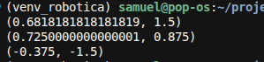
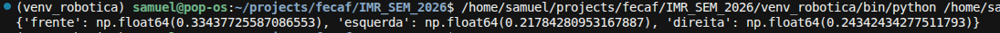
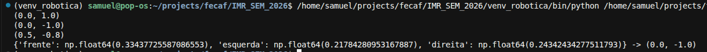
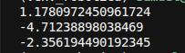
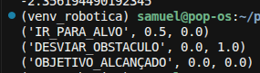

# Relatório Final — AULA 05: AC-2 Parte Final — Nós de Atuação, Sensoriamento e Máquina de Estados (estilo ROS 2)

## 1. Resultados Encontrados nos Exercícios

### Exercício 1 — Nó Atuador: Conversor de `/cmd_vel` com Saturação dos Motores

A ideia aqui é converter `v` e `omega` em velocidade de cada roda:

```text
v_e = v - omega * L / 2
v_d = v + omega * L / 2
```

E se alguma roda passar do limite de 1.5 m/s, não dá pra simplesmente cortar ela sozinha — isso ia bagunçar a curva que o robô ia fazer. Por isso eu reduzo as duas rodas juntas, na mesma proporção, então o robô continua curvando do mesmo jeito, só que mais devagar.

Testei com `converter_cmd_vel(1.2, 3.0)`: a roda direita ia sair a 1.65 m/s, acima do limite, então as duas foram reduzidas proporcionalmente. Com `converter_cmd_vel(0.8, 0.5)` nada precisou mudar, já estava dentro do limite. E com `converter_cmd_vel(-1.0, -4.0)` dá pra ver que funciona igual pros valores negativos.



---

### Exercício 2 — Nó Sensor: Processador e Filtro do Tópico `/scan`

Essa função pega as 360 leituras do lidar (uma por grau) e separa em 3 setores: frente (345° a 15°, passando pelo 0°), esquerda (45° a 135°) e direita (225° a 315°). Antes de pegar o menor valor de cada setor, eu descarto leitura menor que 0.1 m ou maior que 5.0 m, porque isso é ruído do sensor, não é um obstáculo de verdade.

No teste eu forcei ruído de propósito: coloquei `0.0` e `8.0` bem no meio do setor frontal. Se o filtro estiver certo, esses valores somem e o `frente` mostrado é uma leitura real.



---

### Exercício 3 — Lógica Reativa de Obstáculos (Braitenberg com Trava de Segurança)

Regra simples: se tiver algo muito perto na frente (menos de 0.4 m), o robô para e gira pro lado que tem mais espaço livre. Se a frente estiver livre, ele anda pra frente e só ajusta a curva conforme a diferença entre esquerda e direita. O ganho dessa correção lateral (`Kp = 1.0`) o roteiro não definiu, escolhi um valor que corrige sem ficar balançando muito.

Testei os três cenários: obstáculo mais perto na direita, obstáculo mais perto na esquerda, e frente livre com uma leve diferença nos lados. Também encadeei com o Exercício 2, pra mostrar o sensor alimentando esse controle direto.



---

### Exercício 4 — Controlador Proporcional para Atração ao Alvo

Aqui é o clássico: calcula o ângulo até o alvo com `atan2`, tira a diferença pra orientação atual do robô (normalizada entre -π e π) e multiplica por um ganho (`Kp = 1.5`) pra virar o robô na direção certa.

Testei com o alvo em 45°, depois com o alvo bem atrás do robô, e por último com o robô já em cima do alvo. Esse último caso é engraçado: quando não tem distância nenhuma até o alvo, o `atan2(0, 0)` devolve zero, sem significado real — por isso o Exercício 5 sempre confere a distância antes de confiar nesse ângulo.



---

### Exercício 5 — Máquina de Estados Finitos do Robô Autônomo

Essa função junta os três exercícios anteriores numa máquina de estados com uma ordem de prioridade: primeiro confere se já chegou no alvo (menos de 0.2 m de distância), depois se tem obstáculo bloqueando a frente (menos de 0.5 m), e só se nenhum dos dois acontecer, ele segue em direção ao alvo.

Testei os três estados separadamente: caminho livre até o alvo, obstáculo na frente antes de chegar, e robô já perto o suficiente do alvo.



A ordem das checagens importa: se checar o obstáculo antes do alvo, o robô pode ficar tentando desviar de uma parede mesmo já tendo chegado onde precisava. E se checar o alvo antes do obstáculo... bem, aí ele bateria de frente tentando chegar lá.

---

## 2. Exercício de Maior Dificuldade

Pra mim, o mais difícil foi o **Exercício 5**.

Não tem matemática nova nele, o problema é acertar a ordem das prioridades entre os estados. Errar essa ordem não dá erro no código, mas dá comportamento errado do robô em situações específicas — tipo o robô do lado de uma parede logo depois de chegar no alvo. Também tive que decidir sozinho a velocidade de avanço do estado `IR_PARA_ALVO` (usei 0.5 m/s, igual ao Exercício 3), já que o roteiro não falava esse número.

---

## 3. Impressões Gerais sobre as Dificuldades Técnicas

1. **Saturar as duas rodas junto, não cada uma sozinha:** no Exercício 1, se limitasse cada roda separado, o robô ia acabar curvando diferente do que o comando original pedia. Reduzindo as duas juntas, ele só fica mais lento, mas mantém a curva certa.

2. **Filtrar antes de calcular:** no Exercício 2, se não descartar o ruído antes de pegar o menor valor, um único `0.0` de leitura ruim já faz o robô "achar" que tem parede onde não tem.

3. **Ganhos que o roteiro não dá:** tanto o `Kp` do Exercício 3 quanto a velocidade do Exercício 5 precisaram ser escolhidos por mim. Isso muda o comportamento na prática, então vale sempre anotar o porquê da escolha.

4. **`atan2` tem um caso chato:** no Exercício 4, quando o robô já está em cima do alvo, o ângulo calculado não quer dizer nada. Por isso sempre checar a distância antes de confiar no ângulo.

5. **Juntar tudo como se fossem nós do ROS 2:** os cinco exercícios lembram bastante como um sistema real de robô é dividido — cada parte (sensor, atuador, controle, lógica de estado) funciona sozinha e só depois é combinada. Isso ajudou bastante a testar cada pedaço sem precisar rodar tudo de uma vez.
